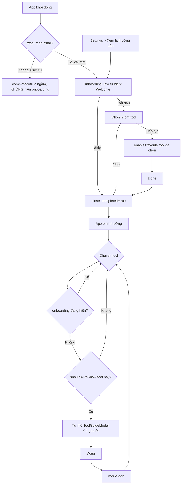

# Onboarding flow

## Phương án đã chọn

Hai cơ chế tách biệt, bổ sung nhau:

**A. Global onboarding (1 lần đầu)** — Dialog 3 bước (Welcome → chọn nhóm tool quan tâm →
Done) tự hiện cho user cài mới. Chọn nhóm tool sẽ `enable` + `favorite` các tool trong nhóm
đó (tận dụng `FeatureContext` sẵn có). Có thể Skip ở mọi bước (Esc/click overlay = Skip).
Xem lại được bất cứ lúc nào qua nút "Xem lại hướng dẫn" trong Settings.

**B. Per-tool "what's new" guide** — Mở rộng `ToolGuideModal`/`TOOL_GUIDES` sẵn có (không
xây hệ thống mới song song) bằng 1 map `TOOL_GUIDE_VERSIONS` (version thủ công do dev tăng
khi sửa hành vi/nội dung guide của tool). Guide tự mở khi: user mở 1 tool lần đầu tiên
trong đời (kể cả cài mới), HOẶC tool đó có version mới hơn version user đã xem lần cuối.

## Lý do

- Tận dụng tối đa hạ tầng có sẵn (`FeatureContext`, `persistentStore`, `ToolGuideModal`)
  thay vì xây cơ chế lưu trữ/UI mới — đúng nguyên tắc "không tạo pattern lạ nếu đã có
  chuẩn" của `ui-ux-design-skill`.
- Tách 2 cơ chế (global 1-lần vs per-tool theo version) vì mục đích khác nhau: A là định
  hướng ban đầu (chọn bộ tool quan tâm), B là thông báo thay đổi liên tục theo vòng đời
  sản phẩm — gộp chung sẽ làm cả 2 luồng khó kiểm soát điều kiện hiện/ẩn.
- Version guide là thủ công (không tự động detect thay đổi hành vi) vì không khả thi tự
  động hoá đáng tin cậy — quyết định của user khi được hỏi.

## Cơ chế phân biệt user mới / user cũ

`wasFreshInstall()` (`src/lib/persistentStore.ts`) chụp lại **1 lần duy nhất**, ngay sau
`initPersistentStore()` — tức là **trước khi bất kỳ React provider nào kịp mount và ghi
default data vào store**. Vì vậy tín hiệu này chính xác bất kể thứ tự provider, không phụ
thuộc race condition giữa các `useEffect`. Cả `OnboardingContext` (seed `completed=true`
cho user cũ) và `useToolGuideTracking` (backfill mọi tool hiện có là "đã xem" cho user cũ)
đều dùng chung tín hiệu này để tránh làm phiền người đã quen dùng app khi họ upgrade lên
bản có tính năng này.

## Flow diagram (cuối cùng)

## AC/DoD cuối (đã verify bằng test + build, chưa manual QA trên app thật)

Xem chi tiết AC trong lịch sử hội thoại — tóm tắt: cả 12 AC (7 của A + 5 của B) đã implement
và cover bởi unit test cho phần logic (`OnboardingContext`, `useToolGuideTracking`,
`wasFreshInstall`). `npx vitest run` (27/27 pass) và `npm run build` xanh.

## Risk còn tồn đọng

- **Chưa chạy thử tay trên app thật** (Tauri dev) — AI agent không tự chạy dev server theo
  quy định `CLAUDE.md`. User cần tự verify luồng UI trước khi coi là hoàn tất 100%.
- Nhóm tool trong `ONBOARDING_TOOL_GROUPS` (`src/lib/onboardingToolGroups.ts`) là phân loại
  thủ công, không tự đồng bộ khi có tool mới thêm vào `TOOL_DEFS` — cần cập nhật tay khi
  thêm tool mới nếu muốn tool đó xuất hiện ở bước chọn nhóm.
- `TOOL_GUIDE_VERSIONS` phụ thuộc hoàn toàn vào việc dev nhớ tăng version thủ công khi sửa
  guide — không có cảnh báo/lint nào nếu quên.
