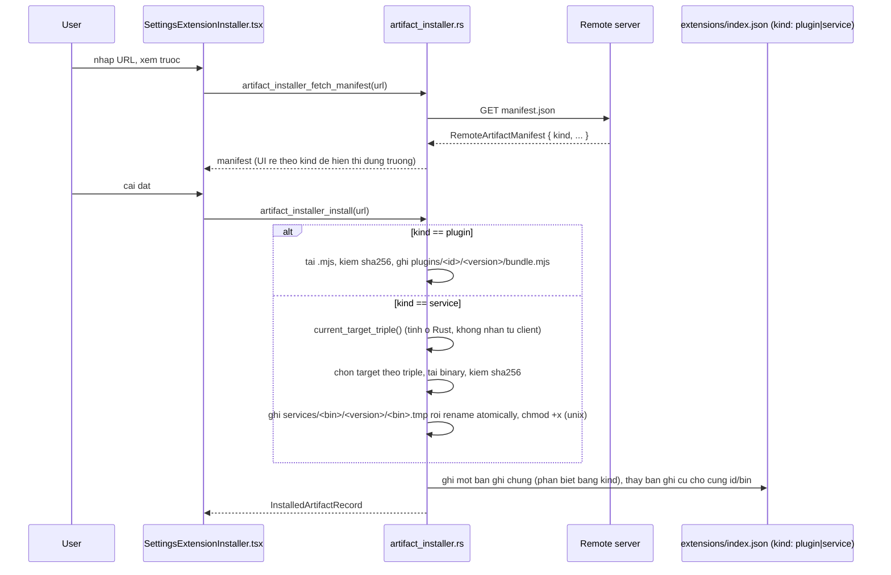
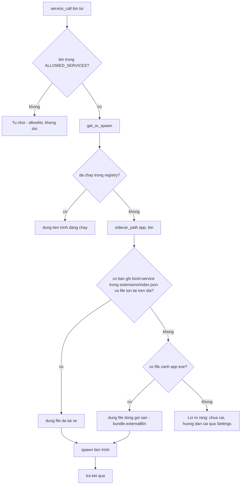

# Cài đặt sidecar native (Tier B) từ URL bên ngoài

## Bối cảnh

Phase 1 (đã xong) cho phép cài một plugin JS/TS từ URL: tải manifest JSON + một
bundle `.mjs`, kiểm SHA-256 hai lần, nạp qua `blob:` URL + `import()` động.
Cơ chế đó CHỈ chạy được cho code chạy trong webview — không áp dụng được cho
sidecar Tier B (binary native, chạy như tiến trình riêng, nói JSONL qua
stdin/stdout, xem `src-tauri/src/service_host.rs`).

Mục tiêu: mở khả năng đó cho sidecar native, để cuối cùng app release gốc
không cần đóng gói sẵn các tool nặng (Kafka/RabbitMQ/Redis/Container) — người
dùng tải sidecar riêng qua URL khi cần, y hệt cách plugin JS được cài hiện tại.

**Không mâu thuẫn với ranh giới tin cậy hiện có**: `ALLOWED_SERVICES`
(`service_host.rs`) chặn theo TÊN, quyết định lúc biên dịch — không đổi bởi
việc này. Tên bin nào được phép chạy vẫn do người viết code quyết định khi tới
lượt port một tool. Việc cần mở rộng chỉ là (1) `sidecar_path()` phải tìm thêm
ở một thư mục ghi được ngoài "cạnh file thực thi", và (2) một cơ chế tải/kiểm/
cấp quyền thực thi đặt binary vào đó.

**Ký code (macOS)**: không cần thêm việc. App hiện dùng ad-hoc signing
(`signingIdentity: "-"`); trên Apple Silicon `cargo build --release` tự ký
ad-hoc mọi binary lúc link (bắt buộc của kernel), và vì cơ chế tải chỉ ghi
đúng byte tải về (không sửa gì) nên chữ ký giữ nguyên. Gatekeeper chủ yếu chặn
file có cờ quarantine (trình duyệt/Finder gắn) hoặc mở qua LaunchServices —
sidecar tải bằng `reqwest`, chạy bằng spawn tiến trình con trực tiếp, nên
nhiều khả năng không dính. Quyết định: xây cơ chế trước, xác minh thật trên
macOS sau.

## ✅ Chosen: Gộp chung "external artifact installer" tổng quát (kind: plugin | service)

Một `RemoteArtifactManifest { kind: "plugin" | "service", ... }`, một
`extensions/index.json` chung cho cả plugin JS lẫn sidecar native, một
`SettingsExtensionInstaller.tsx` thay `SettingsPluginInstaller.tsx` — thay vì
tách hẳn thành module riêng, `plugin_installer.rs` được refactor thành
`artifact_installer.rs` tổng quát với hai nhánh xử lý theo `kind`.

**Đánh đổi đã chấp nhận có chủ ý**: đòi refactor `plugin_installer.rs` đang
chạy production và cần viết logic migration cho `index.json` cũ (không có
trường `kind`) của người dùng đã cài plugin JS trước đây — đổi lại có một
UI/index duy nhất cho mọi thứ cài từ bên ngoài, không phải hai hệ song song.
Rủi ro lớn nhất (migration index.json cũ) phải được xử lý CẨN THẬN và test
bằng chính hình dạng JSON `plugin_installer.rs` đang ghi ra hôm nay, không
phải dữ liệu tự bịa — không được để mất bản ghi plugin JS đã cài của người
dùng thật.

### Sequence

### Flow — độ phân giải sidecar (`sidecar_path`, phần nhánh `service` của index chung)

**Quyết định quan trọng nhất, giữ nguyên dù gộp installer**: tải-về được kiểm
TRƯỚC, cạnh-exe là fallback SAU. Lý do: phục vụ trực tiếp mục tiêu đã chốt (bỏ
`devtool-svc-redis` khỏi `bundle.externalBin` sau khi Phase 2 xong) — một khi
`bundle.externalBin` không còn liệt kê nó, fallback tự nhiên biến mất, không
cần sửa `sidecar_path` lần nữa.

### Architecture decisions

- `RemoteArtifactManifest` mang `kind: "plugin" | "service"` (serde adjacently-tagged hoặc tương đương), các trường còn lại tuỳ `kind`: nhánh `plugin` giữ nguyên hình dạng `RemotePluginManifest` hiện có (entry/route/icon/permissions/commands/hosts); nhánh `service` mang `{ bin, version, protocol, targets: HashMap<target_triple, {url, sha256}> }`.
- `target_triple` TÍNH Ở RUST (`std::env::consts::OS`/`ARCH`), không nhận từ client/manifest — cùng nguyên tắc với `ALLOWED_SERVICES`: quyết định "chạy binary nào" luôn do host quyết.
- `extensions/index.json` là nguồn sự thật DUY NHẤT cho mọi thứ cài từ bên ngoài (cả hai kind). **Reader tương thích ngược bắt buộc**: một file `index.json` cũ không có trường `kind` phải được hiểu ngầm là toàn bộ record đều là `kind: "plugin"` — viết migration này TRƯỚC, có test bằng chính hình dạng JSON hiện tại của `plugin_installer.rs`.
- Nhánh `service` ghi ATOMIC (tải vào file `.tmp` cùng thư mục, `fs::rename` sau khi khớp checksum) — khác nhánh `plugin` (ghi thẳng) vì file này sẽ được SPAWN, một file dở dang do crash giữa chừng nguy hiểm hơn một bundle JS dở dang. Lưu tại `<app_data>/services/<bin>/<version>/<bin>[.exe]`, tách khỏi `<app_data>/plugins/<id>/<version>/` của nhánh plugin — hai loại nghệ thuật lưu trữ khác nhau dù chia sẻ một index.
- `sidecar_path()` đổi chữ ký nhận `&AppHandle`, đọc phần `kind: "service"` của `extensions/index.json` TRƯỚC, cạnh-exe SAU. **Hàm biên giới tin cậy — review kỹ, không chỉ đọc diff.**
- Cài đè/gỡ một sidecar ĐANG CHẠY: tự động gọi `service_stop(bin)` đã có sẵn ngay sau khi ghi/xoá xong — lần gọi kế tiếp tự spawn lại (hành vi self-healing sẵn có). Một stream đang mở bị ngắt — UI phải cảnh báo trước khi xác nhận.
- Gỡ KHÔNG đụng `service-data/<bin>/` (dữ liệu runtime) — theo quyết định đã chốt.
- KHÔNG thêm bin mới nào vào `ALLOWED_SERVICES`/`bundle.externalBin`/`prepare-service-sidecars.mjs` trong scope này — việc thêm `devtool-svc-redis` (và sau đó bỏ khỏi `externalBin`) là quyết định code riêng, sau khi cơ chế này + Redis Phase 2 đều xong.
- Rollback khi bản mới lỗi: XOÁ bản cũ y hệt Phase 1 (không giữ song song) — dữ liệu 4 tool nặng không cần bảo toàn.
- `SettingsExtensionInstaller.tsx` thay hẳn `SettingsPluginInstaller.tsx`, hiển thị badge phân loại (Plugin/Service) và nhánh hành động khác nhau theo `kind` (route cho plugin, restart-service + cảnh báo ngắt-kết-nối cho service).

### Acceptance Criteria (EARS)

1. **Given** `index.json` cũ (không có trường `kind`) từ một bản cài Phase 1 trước đây, **When** app khởi động sau khi nâng cấp, **Then** mọi plugin JS đã cài vẫn được liệt kê đúng, không mất dữ liệu.
2. **Given** một manifest `kind=service` hợp lệ có target khớp nền tảng hiện tại, **When** cài đặt, **Then** binary được tải, kiểm sha256 khớp, ghi vào `services/<bin>/<version>/`, cấp quyền thực thi (unix), `extensions/index.json` phản ánh bản ghi mới thay bản cũ.
3. **Given** manifest `kind=service` không có target cho nền tảng hiện tại, **When** cài đặt, **Then** bị từ chối, nêu rõ target triple đã tính, không ghi gì xuống đĩa.
4. **Given** checksum tải về không khớp manifest (cả hai kind), **When** cài đặt, **Then** bị từ chối, file/dữ liệu tạm bị xoá, không có bản ghi mới trong index.json.
5. **Given** một sidecar đang chạy, **When** cài đè bản mới thành công, **Then** `service_stop(bin)` được gọi tự động và lần `service_call` kế tiếp spawn đúng binary VERSION MỚI.
6. **Given** không có bản tải-về nhưng có file cạnh exe, **When** `service_call` gọi tới, **Then** vẫn chạy được qua fallback — không đổi hành vi hiện tại.
7. **Given** một bin có cả hai bản, **When** `service_call`, **Then** LUÔN dùng bản tải-về.
8. **Given** người dùng gỡ một sidecar đã cài qua URL, **When** gỡ xong, **Then** `services/<bin>/` bị xoá, `service-data/<bin>/` còn nguyên, sidecar đang chạy (nếu có) bị dừng ngay.
9. **Given** danh sách extensions hỗn hợp cả hai kind, **When** mở Settings, **Then** UI phân biệt rõ bằng badge và hành động phù hợp theo kind.

### Edge cases

- Migration `index.json` cũ thất bại giữa chừng (ghi dở) → phải có đường lùi không mất danh sách plugin JS đã cài.
- Một bản ghi `kind=service` vô tình bị một bản build CŨ (chỉ biết đọc plugin, chưa cập nhật) đọc nhầm/hiển thị sai — rủi ro tương thích ngược nếu người dùng rollback app.
- Sai target-triple/thiếu checksum cho nền tảng người dùng → từ chối rõ ràng, nêu đúng triple đã tính, không đoán/thử triple khác.
- App crash giữa lúc tải nhánh service → chỉ có file `.tmp` mồ côi, `sidecar_path()` không bao giờ tìm thấy nó (chỉ tìm tên file cuối cùng đã rename); lần cài sau ghi đè tmp cũ.
- Cập nhật khi sidecar đang phục vụ stream → stream bị ngắt ngay khi `service_stop` chạy; UI cảnh báo trước khi xác nhận nếu phát hiện bin đó đang có kết nối mở.
- `index.json` nói đã cài nhưng file bị xoá/hỏng đĩa → rơi xuống fallback cạnh-exe nếu có, không thì báo lỗi rõ ràng hướng dẫn cài lại — không panic, không treo.
- Hai lệnh cài/gỡ cùng bin/id đồng thời → serialize bằng Mutex chung (mở rộng `InstalledIndex` hiện có để bao cả hai kind).
- Manifest quên hậu tố `.exe` cho Windows → host tự thêm khi đặt tên file cuối cùng trên đĩa, không lấy tên file từ URL.
- bin cài thành công qua URL nhưng không nằm trong `ALLOWED_SERVICES` → `service_call` vẫn từ chối như hiện tại; cài qua URL không tự cấp quyền chạy.

### Definition of Done

- `extensions/index.json` đọc được cả hai schema (cũ không có `kind`, mới có `kind`) không mất dữ liệu người dùng thật — có test bằng chính hình dạng JSON hiện tại.
- `artifact_installer.rs` (đổi tên/refactor từ `plugin_installer.rs`): nhánh `plugin` giữ nguyên hành vi hiện có (không regress), nhánh `service` mới có `current_target_triple`, `stage_install`/`stage_uninstall` atomic + chmod, test thuần (temp dir, không cần AppHandle giả).
- `sidecar_path()` nhận `AppHandle`, đọc phần `kind=service` của `extensions/index.json` trước rồi fallback cạnh-exe, test chứng minh thứ tự ưu tiên (đặt cùng tên bin ở cả hai chỗ, xác nhận bản tải-về được chọn).
- `artifact_installer_install`/`artifact_installer_uninstall` (nhánh service) gọi `service_stop(bin)` khi bin đang chạy, có test cho cả hai.
- `src/platform/artifactInstaller.ts` (hoặc mở rộng `installer.ts` hiện có) export đủ hàm cho cả hai kind.
- `SettingsExtensionInstaller.tsx` thay `SettingsPluginInstaller.tsx`: xem trước, cài, danh sách với badge kind, nút cập nhật/gỡ có cảnh báo ngắt kết nối cho service.
- `docs/ai/CLAUDE.md` + `docs/decisions/architecture/platform-plugin-architecture.md` cập nhật mô tả schema mới, đường migration, và layout `services/<bin>/<version>/` + thứ tự resolution.
- Không thay đổi `ALLOWED_SERVICES`/`bundle.externalBin`/`prepare-service-sidecars.mjs` trong phạm vi này.

### Task breakdown

| # | Việc | Phụ thuộc | Ghi chú review |
|---|---|---|---|
| 1 | Thiết kế + viết migration reader cho `index.json` cũ (không trường `kind`) sang schema mới, test bằng file mẫu lấy đúng hình dạng `plugin_installer.rs` hiện ghi ra | — | **Rủi ro cao nhất — không dùng dữ liệu tự bịa** |
| 2 | Refactor `plugin_installer.rs` → `artifact_installer.rs` tổng quát, thêm nhánh `service` (tải theo target-triple, chmod, atomic rename) cạnh nhánh `plugin` hiện có | 1 | **Chạm code Phase 1 đang chạy thật — review kỹ, không chỉ chạy test xanh** |
| 3 | Sửa `sidecar_path()` đọc phần `service` của index chung, giữ nguyên thứ tự ưu tiên tải-về-trước; test tích hợp round-trip (cài → resolve đúng → `service_call` qua binary vừa cài, dùng `cat`/`sh` giả làm target) | 2 | **Hàm biên giới tin cậy — review kỹ trước merge** |
| 4 | `src/platform` phía TS cho nhánh service (mirror `installer.ts`, bỏ phần blob/import()) | 3 | |
| 5 | `SettingsExtensionInstaller.tsx` thay `SettingsPluginInstaller.tsx`, badge phân loại, nhánh hành động theo kind, cảnh báo ngắt-kết-nối cho service | 4 | **Thay hẳn component hiện có — test đảm bảo luồng cài plugin JS hiện tại không hỏng** |
| 6 | Cập nhật docs mô tả schema mới + đường migration + layout service | 1-5 | |

### Open questions còn lại (không chặn triển khai)

- Xác minh Gatekeeper/quarantine thật trên máy Apple Silicon — làm SAU khi cơ chế chạy được, không thiết kế trong phạm vi này.
- Thời điểm cụ thể thêm `devtool-svc-redis` vào `ALLOWED_SERVICES`/`externalBin` rồi bỏ khỏi mặc định — quyết định riêng, sau khi Redis Phase 2 Bước 2-5 xong.

Rejected: Module cài đặt native sidecar riêng, tách khỏi cơ chế cài plugin JS

`service_installer.rs` mới, mirror `plugin_installer.rs` nhưng tách biệt hoàn
toàn — `RemoteServiceManifest` là type riêng, `services/index.json` riêng,
`SettingsServiceInstaller.tsx` riêng, không chạm gì vào code Phase 1 đang chạy
production.

**Vì sao không chọn**: người dùng ưu tiên một UI/index duy nhất cho mọi thứ
cài từ bên ngoài hơn là giảm rủi ro migration. Đánh đổi ngược lại: hai module
gần giống nhau (một index riêng cho plugin, một cho service), người dùng phải
biết vào hai chỗ khác nhau tuỳ loại muốn cài/quản lý.

